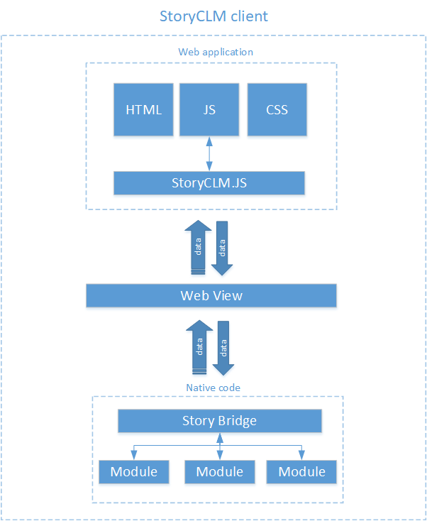

# StoryCLM.JS

StoryCLM.js - это библиотека, предоставляющая доступ к системным функциям (API) платформы StoryCLM.
Библиотека должна использоваться в HTML5 приложениях для StoryCLM.
В других CLM системах, а так же без StoryCLM данная библиотека работать не будет.

## Принцип работы

StoryCLM  позволяет разработчикам  создавать полноценные приложения, использую веб-технологии, такие как HTML, CSS, и JavaScript. Приложения для StoryCLM  - это Web приложения, выступающие в роли пользовательского интерфейса, запускаемых на WebView устройства и взаимодействуют с клиентским приложением по средствам вызова нативноего кода. За вызов нативного кода отвечает мост.

Мост - это прослойка между нативным кодом и Web приложением на стороне нативного кода, которая умеет принимать команды от WebView, находить и запускать модули-обработчики и возвращать результат работы обратно в WebView. Мост может самостоятельно посылать команды в WebView, вызывая код в Web приложении. Мост отвечает за взаимодействие на стороне нативного кода и явлется частью клиентского приложения. Под каждую операционную систему мост имеет разные реализации и встроен в клиентское приложение по умолчанию.

На стороне Web приложения за взаимодействие с мостом отвечает StoryCLM.JS. StoryCLM.JS - это библиотека которая позволяет вызывать нативный код клиентского приложения через стандартный WebView устройства. Web приложение вызывает методы библиотеки, которая в свою очередь создает команду и посылает в мост, после выполнения, клиентское приложение, используя мост, отправляет результат (команду) в WebView, где эту команду и данные перехватывает  библиотека, которая в свою очередь вызывает callback. Таким образом, результат работы нативного кода возвращается в Web  приложение. Web приложению не важно какой операционной системе принадлежит WebView, оно просто оперирует методами библиотеки. Тем самым приложение может одинаково работать на всех клиентах StoryCLM назависимо от операционной системы. Библиотека отвечает за взаимодействие на стороне Web приложения и является его частью. Библиотека имееют единую реализацю под все операционные системы.

Принципиальная схема работы:




## Версия
Текущая версия документации актуальна для StoryCLM.js (1.7.7) и для версии клиентского приложения 3.0.0 и выше.

## Подключение

```sh
<script src="js/storyclm-1.7.7.js"></script>
```

## Возвращаемый объект и ошибки

 В каждую функцию, которая имеет аргумент **callback**, как результат выполненой операции, передается объект msg:

 ```sh
{
   "status":"Success",
   "errorCode":200,
   "errorMessage":"",
   "data":{}
}
```

  * status - статус операции. Если "Success", то операция прошла успешно. Иначе нужно смотреть код ошибки и сообщение об ошибке;
  * errorCode - 200, если операция прошла успешно;
  * errorMessage - сообщение об ошибке;
  * data - данные, которые вернула функция, если операция прошла успешно. Результат выполнения функции;

## Дополнительные материалы
В каталоге "[storyclm.js](https://github.com/storyclm/StoryCLM-Samples/tree/master/storyclm.js)" находятся три приложения - примера. Загрузив их в StoryCLM, можно подробно изучить код и 
детально разобраться в работе библиотеке на реальных примерах:

* [storyclm-js](https://github.com/storyclm/StoryCLM-Samples/tree/master/storyclm.js/storyclm-js) - интерактивный справочник по всем функциям библиотеки с подробным описанием;
* [tables](https://github.com/storyclm/StoryCLM-Samples/tree/master/storyclm.js/tables) - приложение, которое показывает на реальном примере работу с таблицами. В примере продемонстрирована постраничная выборка и CRUD операции.
* [querybuilder](https://github.com/storyclm/StoryCLM-Samples/tree/master/storyclm.js/tablesquery) - конструктор запросов [TablesQuery](https://github.com/storyclm/documentation/blob/master/TABLES_QUERY.md). Приложение - это визуальный конструктор запросов. Конструируя и отправляя запрос, можно освоить работу с выборкой данных из таблиц в StoryCLM. 


## Разделы
Библиотека состоит из шести пространств имен(разделов):

 * [Base](BASE.md) - функции связанные общими сведениями об устройстве, пользователе и навигации.
 * [Presentation](PRESENTATION.md) - функции для манипуляций с приложениями и их содержимым.
 * [Tables](TABLES.md) - работа с системной базой данных.
 * [UI](UI.md) - настройка отображения системных контроллов в приложении.
 * [Http](HTTP.md) - доступ к внешним HTTP ресурсам.
 * [Sessions](SESSIONS.md) - Управление сессиями.
